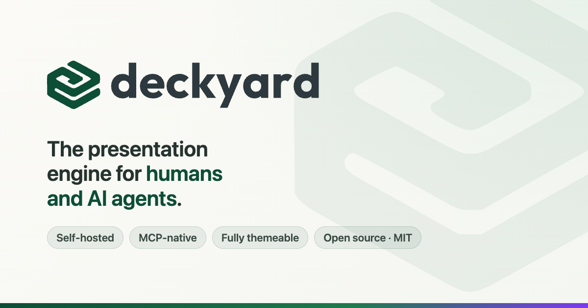

# Deckyard

The presentation engine for humans and AI agents.

Deckyard is a self-hosted, open-source presentation system with a full [Model Context Protocol](https://modelcontextprotocol.io/) (MCP) interface. Create presentations from your browser, let AI agents build them programmatically, or both — it's the same engine underneath.

Built with plain Node.js and vanilla ESM. No framework, no bundler, no vendor lock-in.



## Why Deckyard

**For AI agents:** 22 MCP tools, 6 guided prompts, and a type-aware generation pipeline that understands the difference between a KPI dashboard and a timeline. Connect via stdio (Claude Desktop, Cursor) or SSE (remote agents, [OpenClaw](https://openclaw.ai), webhooks). Your agent doesn't generate slide markup — it describes what it wants, and Deckyard handles the rest.

**For developers:** Self-hosted, BYO LLM (OpenAI, Claude, Mistral), fully themeable, embeddable via JS SDK, white-label ready. Fork it, theme it, extend it with custom slide types. Zero cloud dependencies.

**For presenters:** 38 typed slide types, live presenting with speaker notes, audience follow-along with polls and Q&A, bilingual support (Dutch/English), and an AI wizard that actually understands presentation design.

### What makes it different

| | Gamma / Tome / Beautiful.ai | Google Slides + Gemini | Deckyard |
|---|---|---|---|
| AI generation | ✅ | ✅ | ✅ 38 typed slides |
| MCP interface | ❌ | ❌ | ✅ 27 tools + 6 prompts |
| Self-hosted | ❌ | ❌ | ✅ |
| BYO LLM | ❌ | ❌ | ✅ |
| Custom themes | Limited | Limited | ✅ Full control |
| Embed SDK | ❌ | Limited | ✅ |
| White-label | ❌ | ❌ | ✅ |
| Open source | ❌ | ❌ | ✅ MIT |

## Quick Start

```bash
git clone https://github.com/jaapstronks/deckyard.git
cd deckyard
npm install
npm run start
# Open http://localhost:4177
```

## MCP Server — AI Agent Integration

Deckyard speaks [MCP](https://modelcontextprotocol.io/) natively. Any MCP-compatible client can create, modify, and manage presentations through natural language.

### Connect to Claude Desktop

```json
{
  "mcpServers": {
    "deckyard": {
      "command": "node",
      "args": ["server/mcp/index.js"],
      "cwd": "/path/to/deckyard",
      "env": {
        "DECKYARD_MCP_OWNER_EMAIL": "you@example.com"
      }
    }
  }
}
```

### Connect remotely (SSE transport)

For remote agents, CI/CD pipelines, or platforms like [OpenClaw](https://openclaw.ai):

```bash
# Create an API key
node scripts/create-api-key.js --email you@example.com --name "Agent" --scopes read,write,ai

# Connect to SSE endpoint
POST https://your-deckyard.com/mcp
Authorization: Bearer dk_live_...
```

An installable [OpenClaw skill](skills/openclaw-skill/) is included — drop it in and your agent can build presentations.

### What agents can do

**27 tools** covering the full presentation lifecycle:

- `create_presentation` — Generate a full deck from raw text, bullet points, or meeting notes
- `iterate_presentation` — Modify with natural language ("make slide 3 punchier", "split the KPI slide")
- `append_slides` — Add content to an existing deck (smart positioning before closing slides)
- `convert_slide` — Switch between 38 slide types with AI-powered content adaptation
- `compress_presentation` — Reduce slide count while preserving key messages
- `analyze_presentation` — Get suggestions for improving structure and content
- `validate_presentation` — Check for density issues, repetition, readability problems
- `preview_slide` / `preview_presentation` — Self-contained HTML preview for in-chat rendering
- Comments: `list_comments` / `list_recent_comments` (with slide context + snapshots), `add_comment`, `reply_to_comment`, `set_comment_status` — agents can triage and answer reviewer feedback
- Plus: `add_slide`, `update_slide`, `remove_slide`, `reorder_slides`, `duplicate_presentation`, `list_themes`, `get_presentation_url`, and more

**6 guided prompts** for Claude Desktop's `/` menu:

- `/create-presentation` — Guided deck creation workflow
- `/improve-presentation` — Analyze and improve an existing deck
- `/refine-slide` — Deep-dive into a single slide
- `/compress-presentation` — Distill a long deck
- `/add-content` — Extend a deck with new material
- `/deck-overview` — Structural overview of any presentation

### AI generation pipeline

Deckyard doesn't just dump text onto slides. The AI pipeline:

1. **Outlines** the deck structure, picking from 38 typed slide layouts
2. **Refines** each slide with type-aware content (KPI metrics, timeline entries, process steps — not just bullet points)
3. **Validates** the result: density checks, repetition detection, readability analysis
4. Returns **reasoning** for each type selection and **alternative suggestions**

Theme-aware: if your theme has specific brand colors or background images, the AI sees them and adapts.

Full docs: [`docs/reference/mcp-server.md`](docs/reference/mcp-server.md)

## Customization

Deckyard is designed to be forked and branded. All customizations live in dedicated directories that won't conflict with upstream updates.

### Custom Themes

Create organization-specific themes in `custom/themes/`:

```json
{
  "id": "my-org",
  "label": "My Organization",
  "assets": {
    "logo": "/custom/assets/images/my-logo.svg",
    "logoAlt": "My Organization"
  },
  "cssVars": {
    "--t-color-accent": "#007bff",
    "--t-font-heading": "'Inter', sans-serif"
  }
}
```

See `themes/deckyard.json` for a complete example.

### Custom Slide Types

Add organization-specific slide types in `custom/slide-types/`:

```javascript
// custom/slide-types/my-slide-type.js
import { esc } from '../shared/slide-types/helpers.js';

export default {
  label: 'My Custom Slide',
  fields: [
    { key: 'title', label: 'Title', type: 'string', required: true },
  ],
  defaults: { title: 'New slide' },
  renderHtml: (content) => `
    <div class="slide slide-custom">
      <h1>${esc(content?.title)}</h1>
    </div>
  `,
};
```

### Custom Assets

```
custom/assets/
├── images/
│   └── my-logo.svg
└── fonts/
    └── MyFont.woff2
```

Reference them in your theme: `"/custom/assets/images/my-logo.svg"`

### For Forks

1. Remove the custom directories from `.gitignore`
2. Commit your themes, slide types, and assets
3. Set up upstream tracking:

```bash
git remote add upstream https://github.com/jaapstronks/deckyard.git
git fetch upstream
git merge upstream/main
```

## Configuration

### Environment Variables

Copy `.env.example` to `.env` — it documents every option. The essentials:

```bash
# AI Wizard (choose one or more)
OPENAI_API=sk-...
CLAUDE_API=sk-ant-...
MISTRAL_API=...
DEEPSEEK_API=sk-...

# Default theme (optional, defaults to 'deckyard')
DEFAULT_THEME=deckyard

# MCP owner (for stdio transport)
DECKYARD_MCP_OWNER_EMAIL=you@example.com
```

### Authentication

Auth is **disabled by default**. Enable it by setting:

- `AUTH_ENABLED=true`
- `AUTH_SECRET` — A random secret for session signing
- `AUTH_ADMIN_EMAIL` — This user gets the admin role

Users are managed in the app itself (admin panel, invitations, password
reset). For local development, `AUTH_DEV_BYPASS=true` skips auth entirely and
auto-logs you in as admin.

### Real-time collaboration (presence)

Optional and **off by default** — single-user installs need nothing. Set
`COLLAB_ENABLED=true` and the server mounts a [Yjs](https://yjs.dev)
([Hocuspocus](https://tiptap.dev/docs/hocuspocus)) WebSocket endpoint at
`/collab` inside the same Node process — no extra service, port, or proxy
configuration (WebSocket upgrades ride the same port; Caddy/nginx pass them
through by default). With the flag on, editors show live collaborator
presence: who is in the deck, which slide each person is viewing, and which
field they are editing. Access control reuses the normal presentation
permissions; viewers and share-link guests connect read-only. See
`docs/reference/collab-presence.md` for how it works.

## Deployment

### Docker (Recommended)

```bash
docker compose up -d --build
```

Runs on port 4177. Use the included Caddy configuration for HTTPS.

Going from zero to a live HTTPS instance on a VPS is one command with
[`scripts/vps-bootstrap.sh`](scripts/vps-bootstrap.sh) — see the
[self-hosting guide](docs/ops/self-hosting.md).

### Manual

```bash
npm install --omit=dev
node server/server.js
```

### Data Storage

- Presentations: `server/data/presentations/`
- Uploads: `server/uploads/`

Back up these directories regularly. (Optional Postgres mode: see
`.env.example`.)

## Project Structure

```
deckyard/
├── client/              # Frontend (browser)
├── server/              # Backend (Node.js)
│   ├── mcp/             # MCP server (stdio + SSE)
│   └── utils/ai/        # AI pipeline
├── shared/              # Shared code (slide types, markdown)
├── themes/              # Built-in themes
├── skills/              # Agent skill templates (OpenClaw)
├── custom/              # Your customizations (gitignored)
│   ├── themes/
│   ├── slide-types/
│   └── assets/
├── tests/               # MCP + unit tests
└── docs/                # Documentation
```

## Documentation

- [MCP Server reference](docs/reference/mcp-server.md) — All 27 tools, 6 prompts, transport options
- [Product docs](https://github.com/jaapstronks/deckyard-website) — Features and usage (website repo)
- [Developer docs](docs/developer/README.md) — Architecture and extending
- [Theme reference](docs/developer/themes.md) — Theming system
- [Self-hosting guide](docs/ops/self-hosting.md) — VPS bootstrap, updates, backups
- [ROADMAP](ROADMAP.md) — Where Deckyard is headed

## Contributing

Contributions welcome! See [`CONTRIBUTING.md`](CONTRIBUTING.md) for guidelines.

## Maintainers

Deckyard is built and maintained by [Jaap Stronks](https://github.com/jaapstronks).
For security reports, use GitHub's private vulnerability reporting (see
[`SECURITY.md`](SECURITY.md)); for everything else, open an issue.

## License

MIT License — see `LICENSE` for details.
