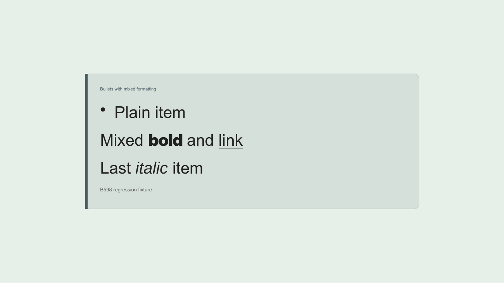
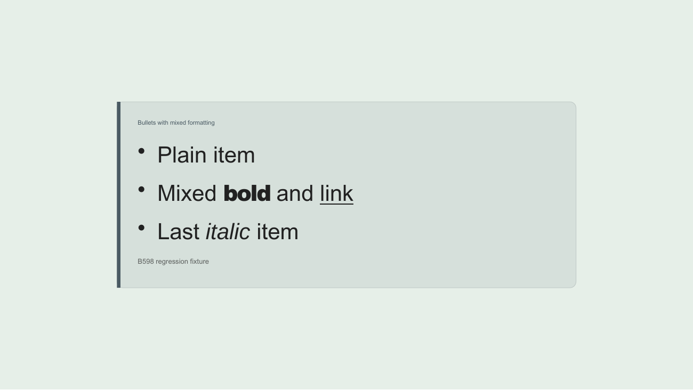

# Editable PowerPoint bullets with mixed formatting

LibreOffice 26.2.4.2 render comparison, 2026-10-06. The same callout slide contains three markdown list items: `Plain item`, `Mixed **bold** and [link](https://example.com/b598)`, and `Last *italic* item`.

Before the fix, only the plain item has a bullet. pptxgenjs 4.0.1 writes an `a:pPr` before every run, so the mixed item contains four paragraph-properties elements. The later `buNone` overrides its bullet in LibreOffice. After the fix, the existing editable-package pass retains the first `a:pPr` in each paragraph, where `paragraphRuns` places the paragraph options. Run properties and hyperlink relationships remain intact.

| Before                                          | After                                      |
| ----------------------------------------------- | ------------------------------------------ |
|  |  |

The generic composition and native callout composition both render all three bullets after the fix; both packages pass the Office package validator. These images use the native callout and the core brand theme. PowerPoint and Keynote were not rendered during this verification.

`tests/export-pptx-paragraphs.test.js` reproduces the defect through the shared run helper and both export compositions. It checks one paragraph-properties element at the start of each paragraph, ordinary and mixed bullets, nesting, explicit numbering, soft and hard breaks, bold/italic, text colour, hyperlink relationships and an unchanged second package pass.

```sh
node --test tests/export-pptx-paragraphs.test.js
```
