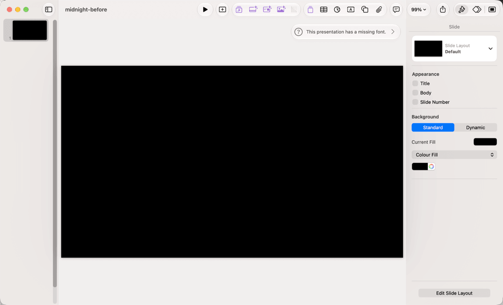
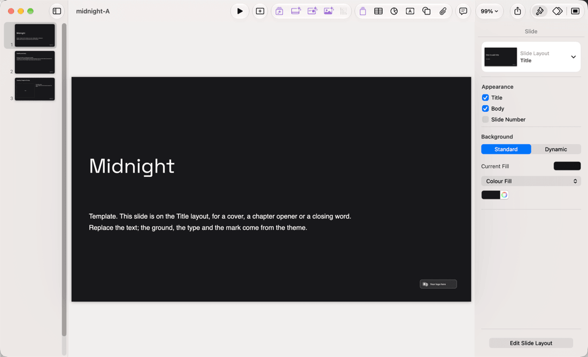
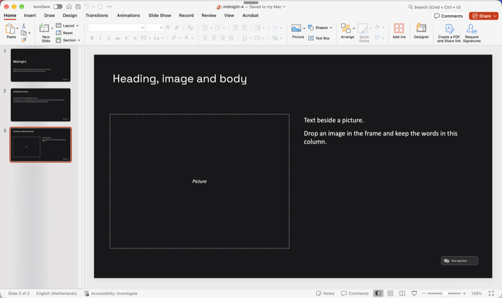

# The theme template's first impression (B637)

Keynote 14 and PowerPoint 16 on macOS 27, 2026-10-09. The same `midnight` theme template, built through `buildThemeTemplateBuffer` and opened without touching anything.

Before, the package held the three theme layouts and no slides. Keynote imports the layouts, but it opens the file on a slide of its own on a black `Default` layout that is not in the package, so the first thing you see is an empty black rectangle and the layouts stay hidden until you insert a slide. After, the file carries one sample slide per layout: Keynote opens on the theme's ground, type and mark, and the navigator shows all three.

| Before                                                               | After                                                                            |
| -------------------------------------------------------------------- | -------------------------------------------------------------------------------- |
|  |  |

"This presentation has a missing font" in the before shot is unrelated and unchanged: `midnight` is set in Space Grotesk and Inter, which are not installed on this machine (D126).

The third sample slide in PowerPoint, where the dashed frame sits around the layout's picture slot and the word sits inside it:

The word goes in the placeholder rather than in a box over it. pptxgenjs writes every placeholder a slide leaves empty onto that slide, and PowerPoint fills such a one with its own "Click to add text" and its insert icons; a second text box over the same rectangle runs straight through them.
